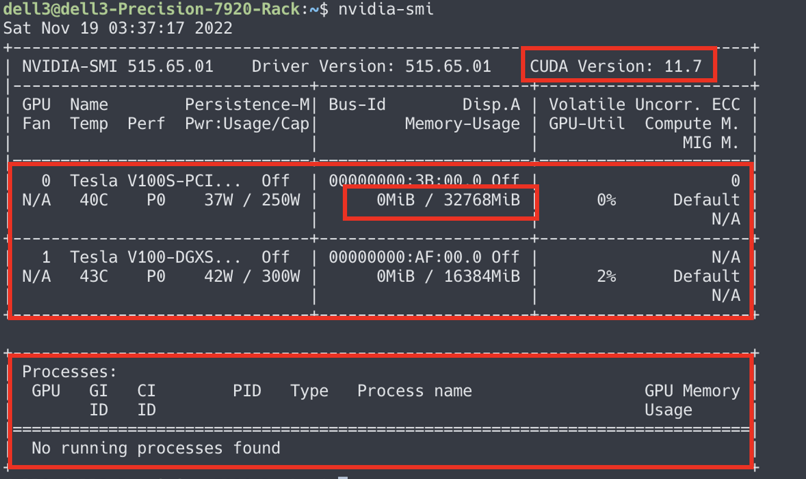

# GPU 相关操作

- `nvidia-smi`

  这是查看显卡信息的最基础的命令，它可以查看显卡的 CUDA 版本，显存情况，哪些进程正在使用等信息

  

  如图所示，从上到下的三个红框，第一个红框显示的是 CUDA 版本，版本号为11.0；第二个红框显示的是两张显卡的使用情况，如子框所示，可见显存的占用情况，图中显示32GB占用了0GB；第三个红框显示的是哪些进程占用了显存，可见暂无 python 进程占用。

- 限制显存占用

  如果你需要与同学同时使用一张显卡时，就需要商量着进行显存分配了。

  - PyTorch

  ```python
  torch.cuda.set_per_process_memory_fraction(0.5,0)
  ```

  参数1：fraction 限制显存的上限比例，0.5就是总显存的一半，可以是 0～1 直接的任何 float 大小

  参数2：device 表示的是设备的型号，0表示的是`device:0`