# PyCharm Remote 配置


1. 使用ssh工具登录远程服务器

   ```shell
   ssh -p 2022 CrossAI@210.30.97.170
   ```

   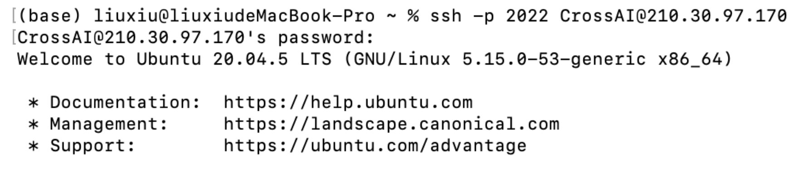

2. 创建虚拟环境

   ```shell
   conda create -n name python=3.7
   ```

3. 点右下角，添加解释器

   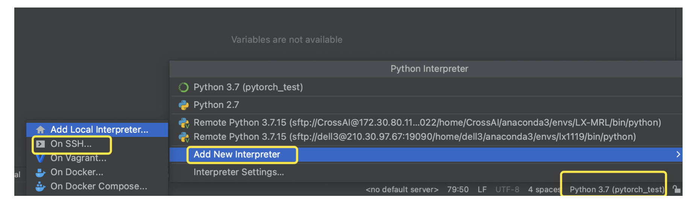

4. 连接服务器

   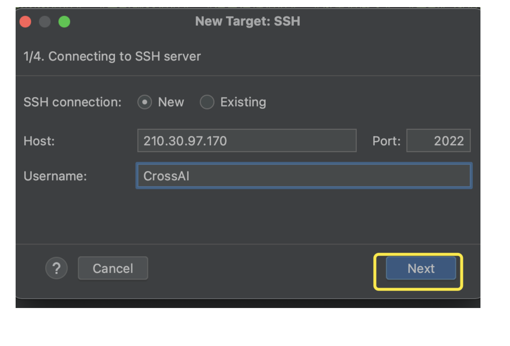

   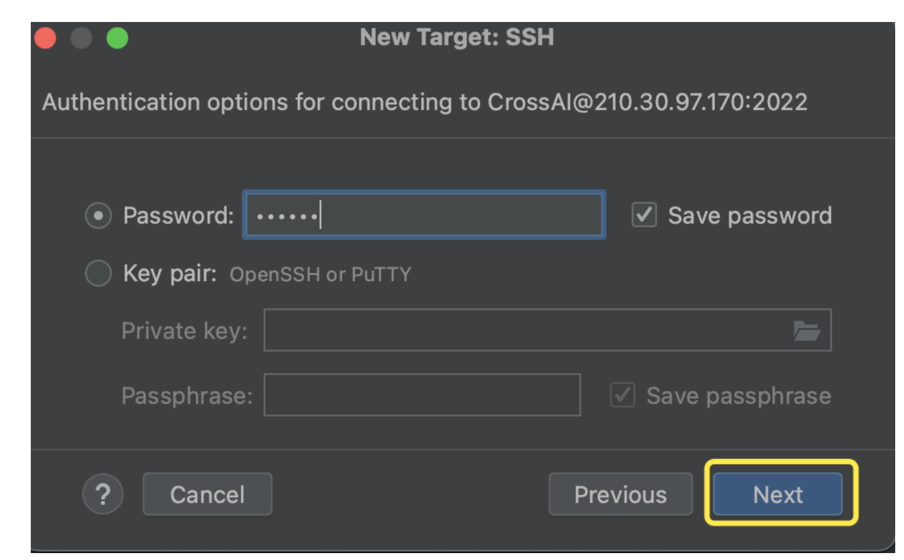

   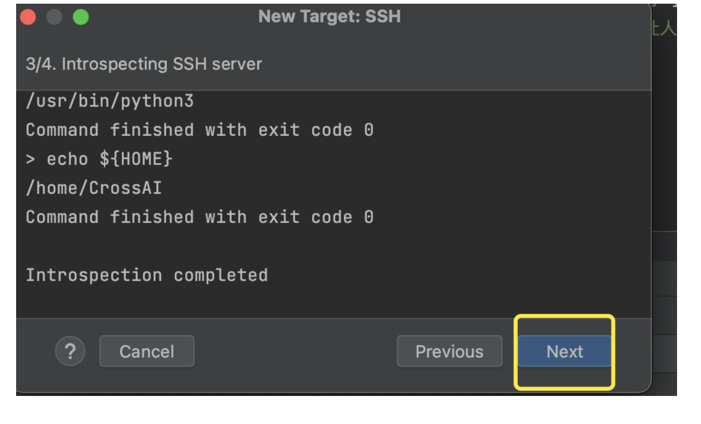

   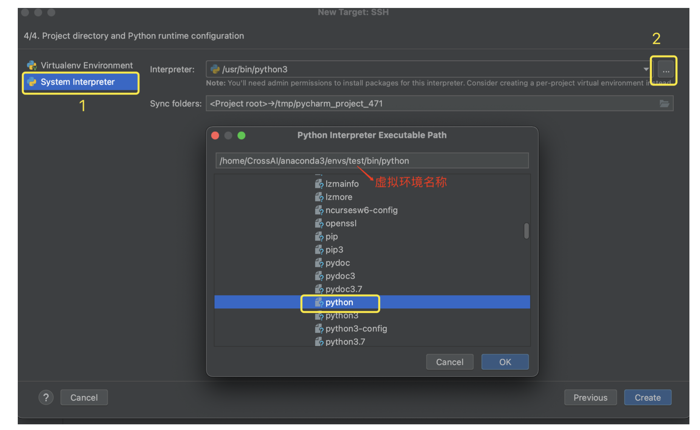

   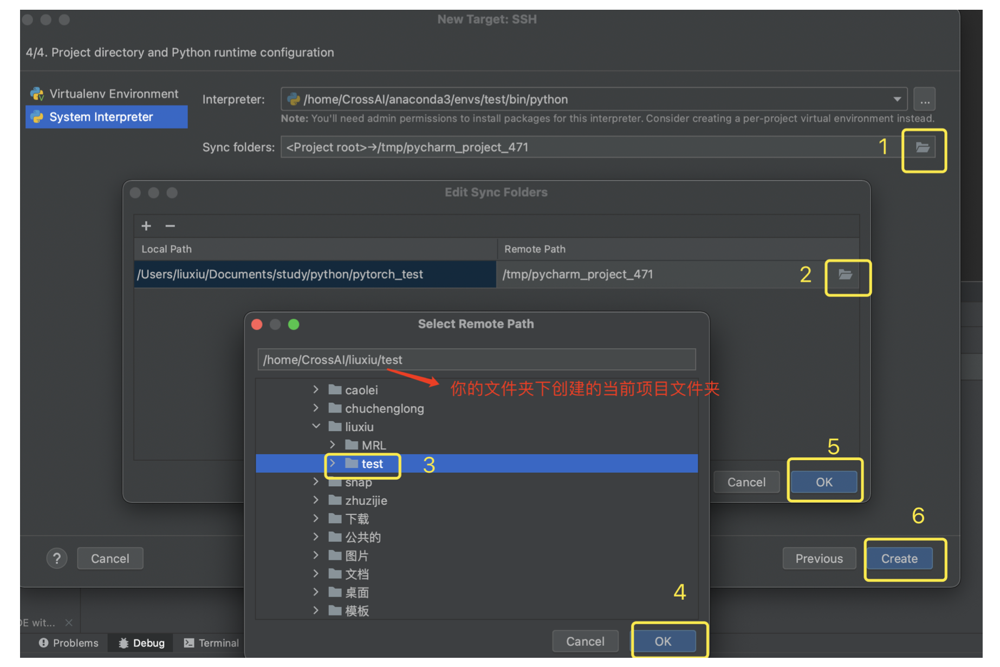

5. sftp上传/下载文件，可以开启自动上传，也可以使用上边选项手动上传。

   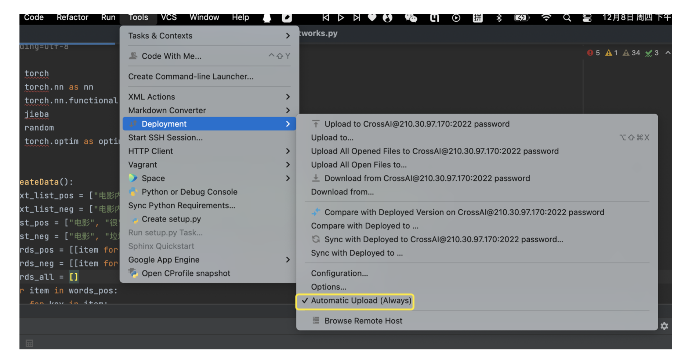

   

   打开远程文件夹可以看到文件已上传。

   

   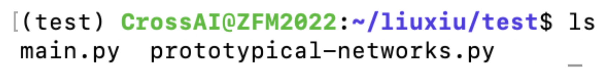

6. 可以在这里设置我们的运行参数

   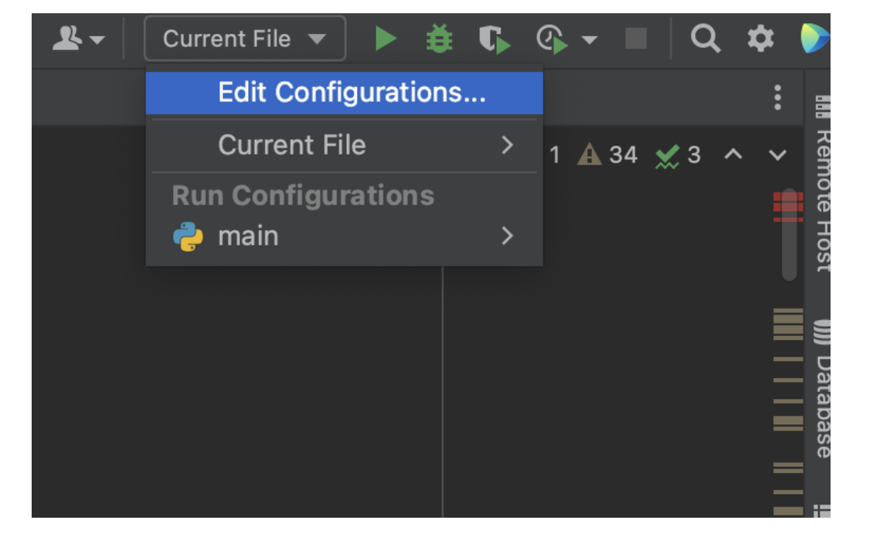

   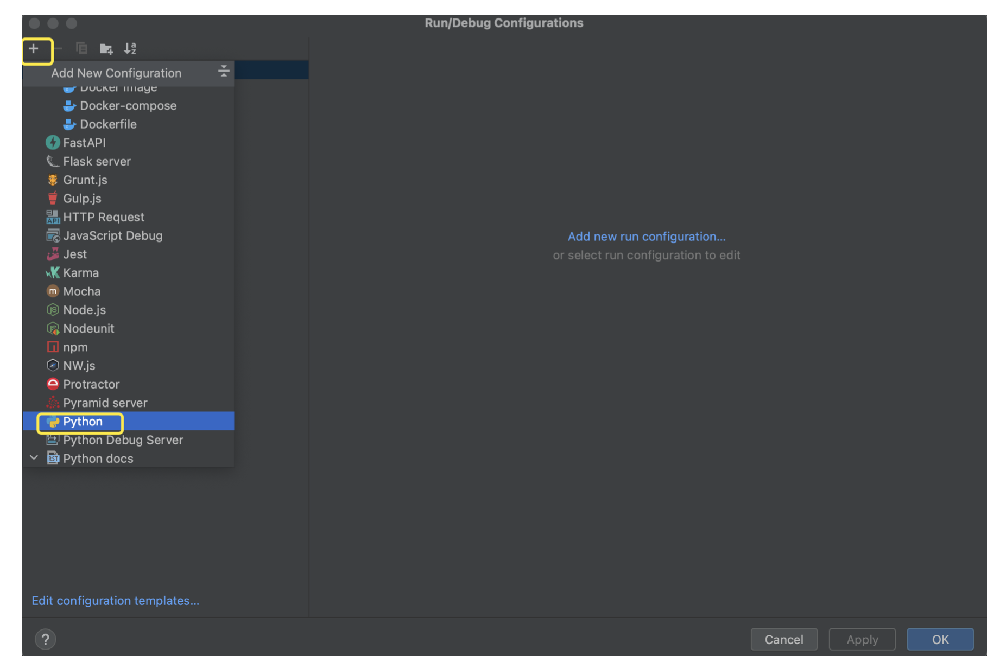

   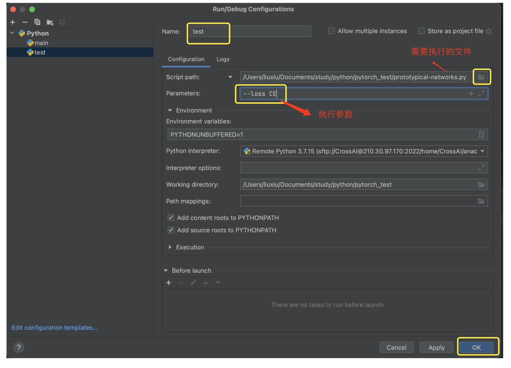

   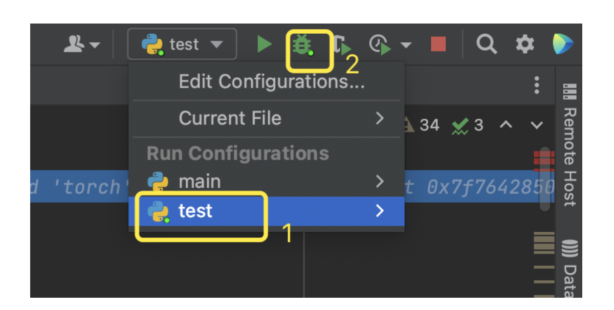

7. 可以打断点进行调试了

8. 终端连接到远程

   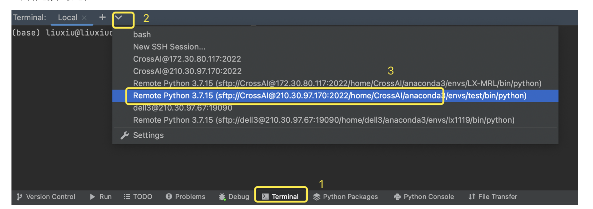

   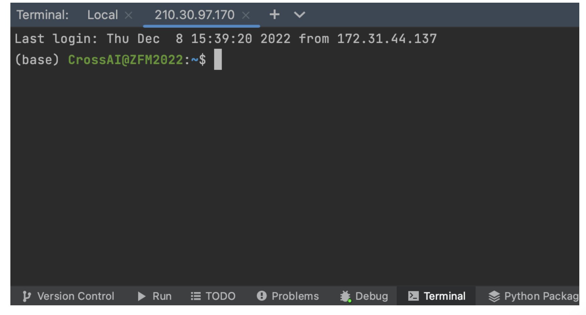