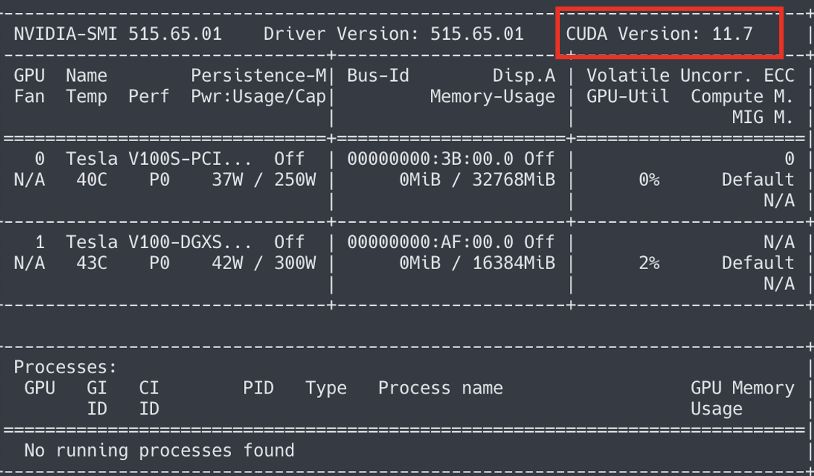
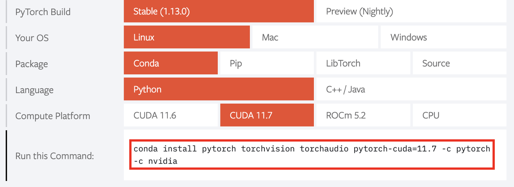

# PyTorch 环境配置

- `conda activate {env_name}` 激活个人虚拟环境

  

- `nvidia-smi` 查看 CUDA 的版本号

  

- 前往 [PyTorch](https://pytorch.org/) 官网查看对应版本信息

  如图所示：

  

- 使用上图红框中的命令，安装 PyTorch

- 通常使用官网命令安装 PyTorch 会十分的缓慢，这里推荐更换镜像源

  ```shell
  conda config --add channels https://mirrors.tuna.tsinghua.edu.cn/anaconda/pkgs/main/win-64/
  conda config --add channels https://mirrors.tuna.tsinghua.edu.cn/anaconda/pkgs/free/win-64/
  conda config --add channels https://mirrors.tuna.tsinghua.edu.cn/anaconda/cloud/pytorch/win-64/
  conda config --set show_channel_urls yes
  conda config --set ssl_verify false
  ```

  此时执行 conda install 时，只需取消后续的`-c pytorch -c nvidia`，便可正常安装


