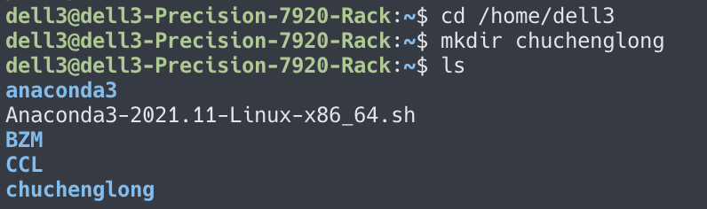
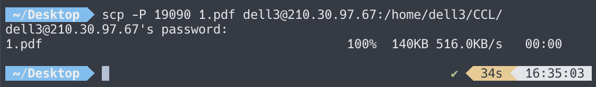
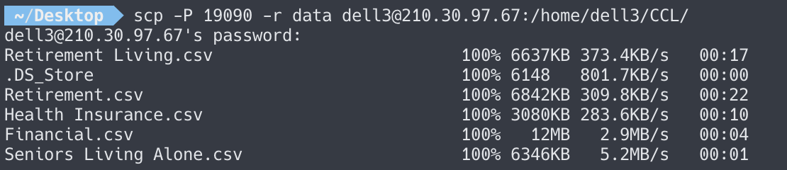
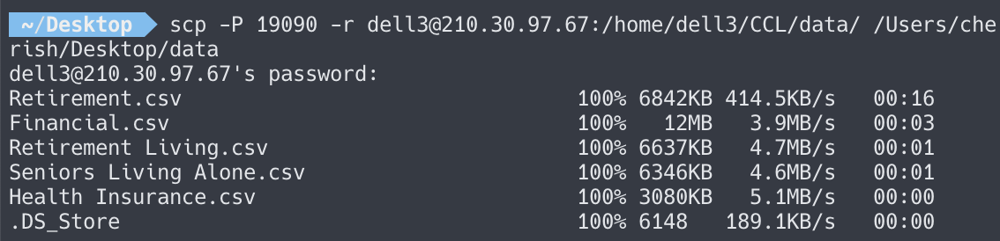

# LinuxServer 实验室服务器操作手册

## 账号申请方法

联系当前服务器管理员

## 服务器介绍

目前服务器是大数据研究所的公用服务器，暂时不允许私自提供给实验室外的人员使用。服务器GPU配置如下：

| Server‘s Name | DEVICE                                        |
| ------------- | --------------------------------------------- |
| R730          | 2*NVIDIA Tesla M60-8G                         |
| R740*         | NVIDIA Tesla V100-32G + NVIDIA Tesla V100-16G |
| R740          | 4*NVIDIA Tesla M60-8G                         |
| CrossAI       | NVIDIA GeForce 4090                           |

## 校内 SSH 方法

目前服务器 ip 为校内分配的内网 ip，校外无法访问。如需校外访问请去办事大厅申请 VPN。

```shell
# example
ssh -p 19090 username@210.30.97.68
```

第一次访问可能会有网络信任确认，输入 yes 即可。

## 文件系统

为了方便服务器存储资源管理，使用者请自行创建个人目录。在/home/CrossAI/ 目录下创建姓名全称的文件夹，之后可以在新建的目录下自由使用。具体示例如下：



## 文件传输

- `scp`  

  从本地的 terminal，可直接通过 scp 命令传输文件与文件夹

  - 从本地上传到服务器

    ```shell
    scp [-P] {port} [-r] {local_file_path} {username}@210.30.97.68:{remote_file_path}
    ```

    例如:

    
    
    如果想要把文件夹整个上传到服务器，那么加上参数`-r`即可。
    
    例如：
    
    
    
  - 从服务器下载到本地
  
    ```shell
    scp [-r] [-P] {port} {username}@210.30.97.81:{remote_file_path} {local_file_path}
    ```
  
    
  
- 使用ftp工具 FileZilla 传输，诸如此类的工具还有 xftp 等等。这类工具均需要配置 ssh，配置方法与上述相同

- 使用shell工具传输

  - windows：自带的 PowerShell，xftp 等等
  - mac： 自带的 terminal