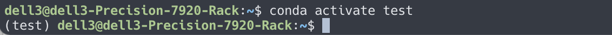

# conda 的基础操作

请勿直接使用系统的 python 进行实验。使用 conda 创建属于个人的虚拟环境，并在其中进行环境的配置与管理。不得私自安装额外的软件，确需安装的，请先联系管理员，倘若擅自安装后造成了版本不兼容等环境问题，请自行处理。

- 创建 conda 虚拟环境

  ```shell
  conda create -n {your_env_name} python=X.X
  ```

  

- 激活虚拟环境

  ```shell
  conda activate {your_env_name}
  ```

  

- 退出虚拟环境

  ```shell
  conda deactivate
  ```

  

- 删除虚拟环境

  ```shell
  conda remove -n {your_env_name} --all
  ```

  

- 查看当前存在哪些虚拟环境

  ```shell
  conda info -e
  ```

  

- 删除虚拟环境中的包

  ```shell
  # 已经 activate 环境时
  python -m pip uninstall {package_name}
  ```

  
